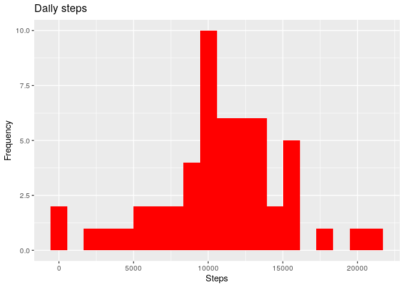
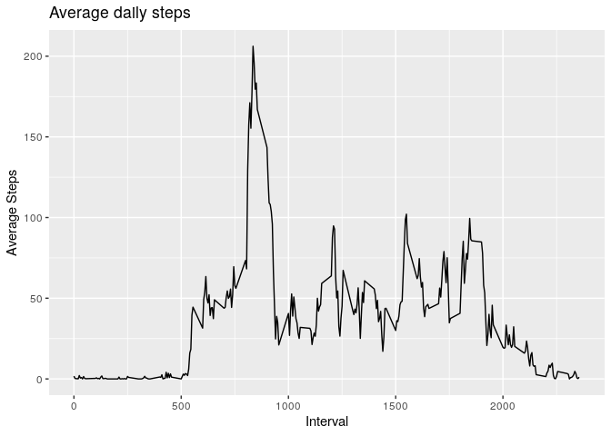

## Introduction
It is now possible to collect a large amount of data about personal movement using activity monitoring devices such as a Fitbit, Nike Fuelband, or Jawbone Up. These type of devices are part of the “quantified self” movement – a group of enthusiasts who take measurements about themselves regularly to improve their health, to find patterns in their behavior, or because they are tech geeks. But these data remain under-utilized both because the raw data are hard to obtain and there is a lack of statistical methods and software for processing and interpreting the data.

This assignment makes use of data from a personal activity monitoring device. This device collects data at 5 minute intervals through out the day. The data consists of two months of data from an anonymous individual collected during the months of October and November, 2012 and include the number of steps taken in 5 minute intervals each day.

The data for this assignment can be downloaded from the course web site:

* Dataset: [Activity monitoring data](https://d396qusza40orc.cloudfront.net/repdata%2Fdata%2Factivity.zip) 

The variables included in this dataset are:

* steps: Number of steps taking in a 5-minute interval (missing values are coded as `NA`)
* date: The date on which the measurement was taken in YYYY-MM-DD format
* interval: Identifier for the 5-minute interval in which measurement was taken

The dataset is stored in a comma-separated-value (CSV) file and there are a total of 17,568 observations in this dataset. 

## Loading and preprocessing the data

Show any code that is needed to

1. Load the data (i.e. `read.csv()`)

```r
unzip("./activity.zip")
data <- read.csv("./activity.csv")
```

2. Process/transform the data (if necessary) into a format suitable for your analysis
    

```r
data$date <- as.Date(data$date, "%Y-%m-%d")
head(data, 5)
```

```
##   steps       date interval
## 1    NA 2012-10-01        0
## 2    NA 2012-10-01        5
## 3    NA 2012-10-01       10
## 4    NA 2012-10-01       15
## 5    NA 2012-10-01       20
```

## What is mean total number of steps taken per day?

1. Calculate the total number of steps taken per day

```r
sums_day <- tapply(data$steps, data$date, sum)
sums_day <- cbind.data.frame(unique(data$date), sums_day)
names(sums_day) <- c("date", "sum")
head(sums_day, 5)
```

```
##                  date   sum
## 2012-10-01 2012-10-01    NA
## 2012-10-02 2012-10-02   126
## 2012-10-03 2012-10-03 11352
## 2012-10-04 2012-10-04 12116
## 2012-10-05 2012-10-05 13294
```

2. If you do not understand the difference between a histogram and a barplot, research the difference between them. Make a histogram of the total number of steps taken each day

```r
library(ggplot2)
g <- ggplot(sums_day, aes(x = sum))
g + geom_histogram(fill = "red", bins = 20) + labs(title = "Daily steps", x = "Steps", y = "Frequency")
```

```
## Warning: Removed 8 rows containing non-finite values (stat_bin).
```

<!-- -->

3. Calculate and report the mean and median of the total number of steps taken per day

```r
mean(sums_day$sum, na.rm = TRUE)
```

```
## [1] 10766.19
```

```r
median(sums_day$sum, na.rm = TRUE)
```

```
## [1] 10765
```

## What is the average daily activity pattern?

1. Make a time series plot (i.e. `type = "l"`) of the 5-minute interval (x-axis) and the average number of steps taken, averaged across all days (y-axis)


```r
mean_interval <- tapply(data$steps, data$interval, mean, na.rm = TRUE)
mean_interval <- cbind.data.frame(unique(data$interval), mean_interval)
names(mean_interval) <- c("interval", "mean_steps")
g <- ggplot(mean_interval, aes(interval, mean_steps))
g + geom_line() + labs(title = "Average daily steps", x = "Interval", y = "Average Steps")
```

<!-- -->

2. Which 5-minute interval, on average across all the days in the dataset, contains the maximum number of steps?


```r
cond <- mean_interval$mean_steps == max(mean_interval$mean_steps)
mean_interval[cond, "interval"]
```

```
## [1] 835
```

## Imputing missing values


## Are there differences in activity patterns between weekdays and weekends?
